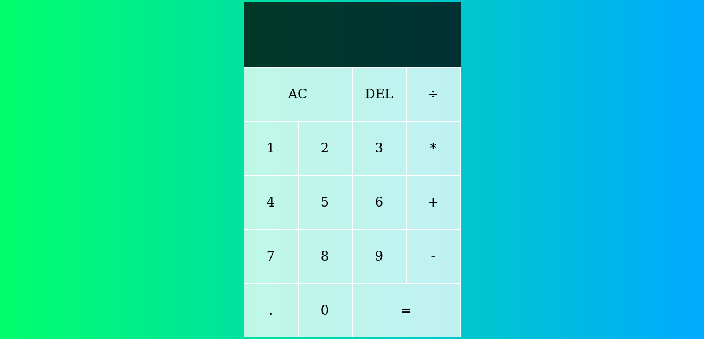

# Calculator Project

Simple calculator project build with HTML, CSS and JavaScript.

## Table of contents

- [Calculator Project](#calculator-project)
  - [Table of contents](#table-of-contents)
  - [Overview](#overview)
    - [The project](#the-project)
    - [Screenshot](#screenshot)
    - [Links](#links)
  - [My process](#my-process)
    - [Built with](#built-with)
    - [What I learned](#what-i-learned)
    - [Continued development](#continued-development)
  - [Author](#author)

## Overview

desgin a frontend page that intract with the user for the aim to practice what i learn on online courses about javascript DOM manipulations.

### The project

- The project is a calculator that made basic operation (multiplication,  division, substraction, addition) 

### Screenshot

### Links

- Live Site URL: [https://tariqelb.github.io/Calculator-Project/](https://tariqelb.github.io/Calculator-Project/)

## My process

### Built with

- Semantic HTML5 markup
- CSS custom properties
- JavaScript
- DOM manipulation

### What I learned

How to use DOM and JavaScript fanctions to build a calculator that made basic operations.

### Continued development

learn DOM and Javascript functions more deeply to know how to build calculator that make all mathematical operation 

## Author

- Facebook - [Tariq El bouhali](https://www.facebook.com/tariqelbouhali)
